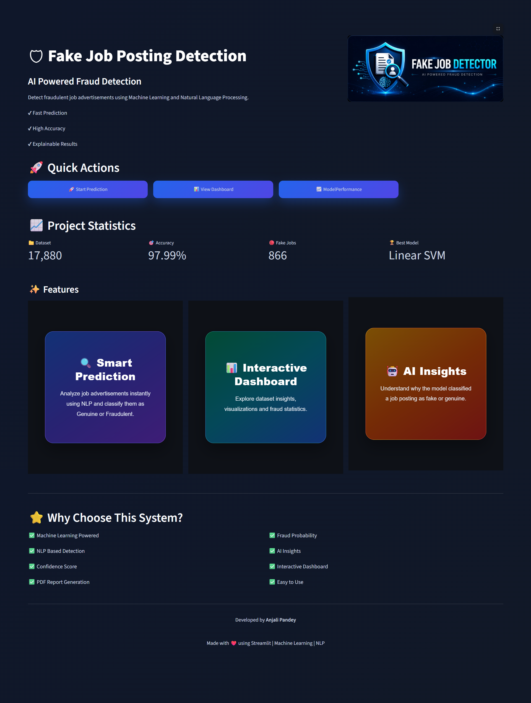
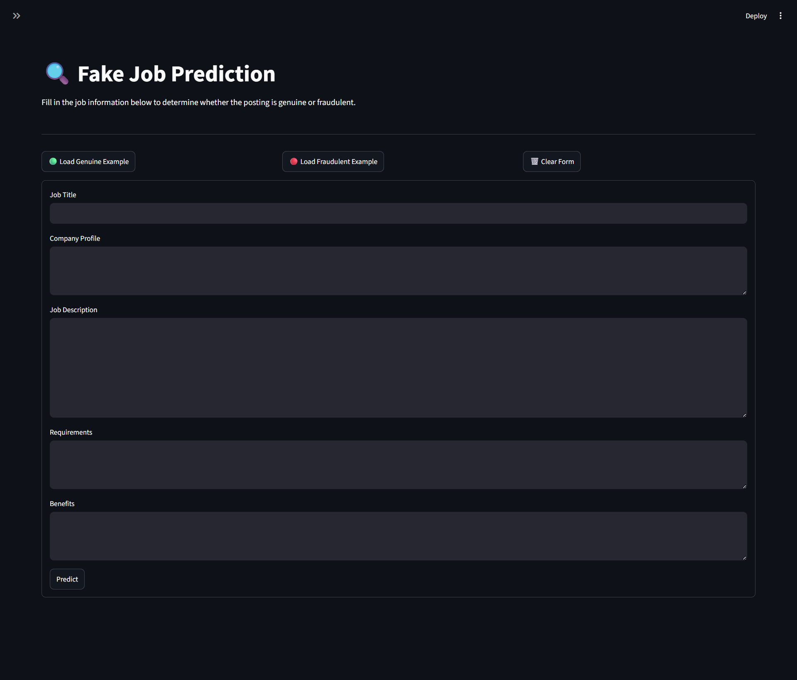
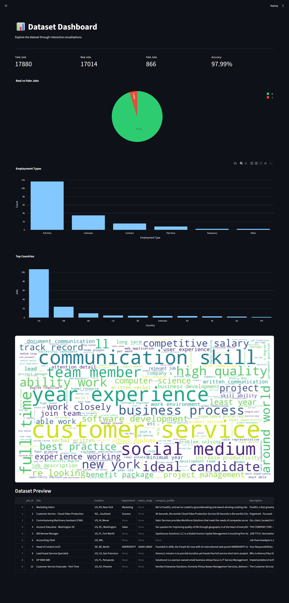
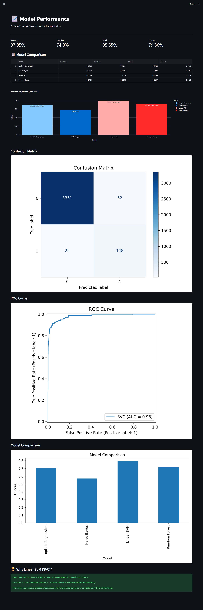
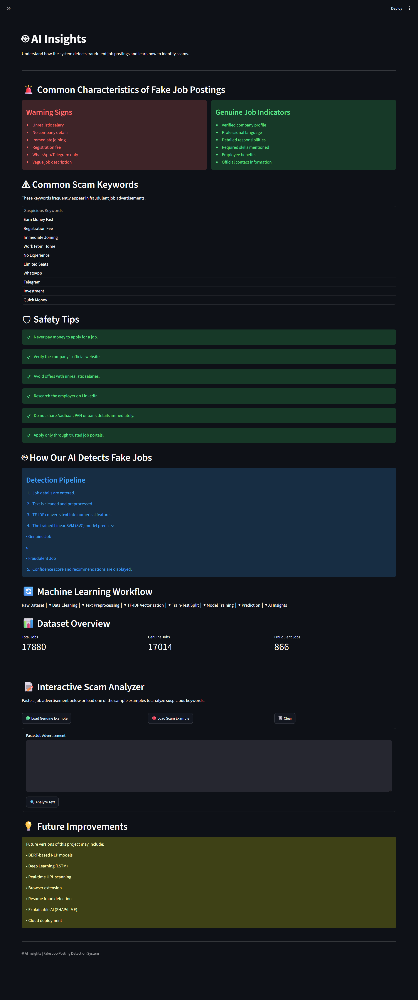
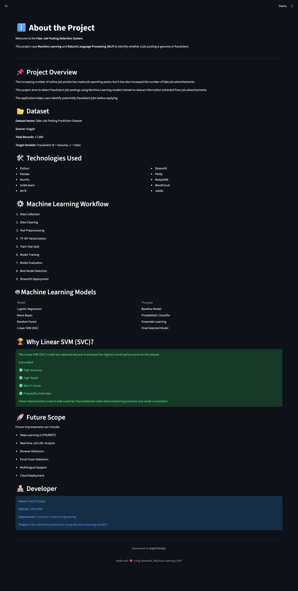

# Github Badges


# 🛡 Fake Job Posting Detection System

<p align="center">


</p>

<p align="center">

A Machine Learning and NLP based web application that detects whether a job posting is **Genuine** or **Fraudulent**.

Built using **Python**, **Scikit-learn**, and **Streamlit**.

</p>

---

# 📌 Project Overview

Online job portals have made recruitment easier than ever, but they have also led to a significant rise in fraudulent job postings.

This project aims to detect fake job advertisements using **Natural Language Processing (NLP)** and **Machine Learning**.

The application analyzes the textual content of a job posting and predicts whether it is genuine or fraudulent. It also provides confidence scores, AI insights, keyword analysis, and downloadable PDF reports.

---

# ✨ Features

- 🔍 Fake Job Prediction
- 🤖 AI Insights
- 📊 Interactive Dashboard
- 📈 Model Performance Comparison
- ⚠ Suspicious Keyword Detection
- 🧠 Hybrid AI Analysis
- 📄 PDF Prediction Report
- 📝 Sample Job Loader
- 🎨 Modern Streamlit UI

---

# 🛠 Tech Stack

| Category | Technologies |
|----------|--------------|
| Language | Python |
| ML | Scikit-learn |
| NLP | NLTK, TF-IDF |
| Data | Pandas, NumPy |
| Visualization | Plotly, Matplotlib |
| UI | Streamlit |
| Report | ReportLab |

---

# 🧠 Machine Learning Workflow

```
Dataset
      │
      ▼
Data Cleaning
      │
      ▼
Text Preprocessing
      │
      ▼
TF-IDF Vectorization
      │
      ▼
Train-Test Split
      │
      ▼
Model Training
      │
      ▼
Prediction
      │
      ▼
AI Insights
```

---

# 📂 Project Structure

```text
Fake_Job_Detection/

├── app.py
├── config.py
├── README.md
├── requirements.txt
├── assets/
├── artifacts/
├── data/
├── images/
├── models/
├── notebooks/
├── pages/
├── styles/
└── utils/
```

---

# 📊 Dataset

- **Dataset Name:** Fake Job Posting Prediction
- **Source:** Kaggle
- **Records:** 17,880
- **Target Variable:** Fraudulent

---

# 🤖 Machine Learning Models

- Logistic Regression
- Naive Bayes
- Random Forest
- Linear SVM (Selected)

The Linear SVM model achieved the best overall performance and was selected for deployment.

---

# 🚀 Installation

Clone the repository

```bash
git clone https://github.com/Anjxlicodes/Fake-Job-Posting-Detection.git
```

Move into the project directory

```bash
cd Fake_Job_Detection
```

Create virtual environment

```bash
python -m venv venv
```

Activate virtual environment

Windows

```bash
venv\Scripts\activate
```

Install dependencies

```bash
pip install -r requirements.txt
```

---

# ▶ Run the Application

```bash
streamlit run app.py
```

---

# 📸 Screenshots

## Home Page

<p align="center">

</p>

---

## Prediction Page

<p align="center">

</p>

---

## Dashboard

<p align="center">

</p>

---

## Model Performance

<p align="center">

</p>

---

## AI Insights

<p align="center">

</p>

---

## About

<p align="center">

</p>

# 📈 Model Performance

| Metric | Score |
|---------|-------|
| Accuracy | 97.85% |
| Precision | 74.00% |
| Recall | 85.55% |
| F1 Score | 79.36% |

---

# 🚀 Future Enhancements

- Deep Learning (LSTM / BERT)
- Explainable AI (SHAP/LIME)
- Browser Extension
- Real-time Job URL Analysis
- Resume Fraud Detection
- Cloud Deployment

---

# 👨‍💻 Developer

**Name:** Anjali Pandey

**Roll Number:** 240004

**Department:** Computer Science Engineering

---

# ⭐ Support

If you found this project useful, consider giving it a ⭐ on GitHub.

---

# 📄 License

This project is developed for educational purposes.